# 实时流端到端流程
本文档作用对象：差分状态与差分改正数（可以发散推广到所有的实时流数据）


## 架构演进
系统目前的挂载点是基于不同数据类型来设计的，差分站状态与差分改正数只有一个挂载点，接收机获取到所有的差分站数据后，筛选出地理位置最近的一个来使用，
数据的利用率只有 1/175 左右，浪费接收机的网络能力、计算能力、功耗，而且增大了接收机功能设计的复杂度。

基于以上痛点，为了更加便于接收机用户使用， 为了使系统演进的更加完美科学，需要修正为基于单个差分站的挂载点设计，从之前的一个挂载点接收机获取数据后筛选，
改为未来的175个挂载点，接收机可以指 定挂载点为AUTO，通过定期上报物理坐标信息，由系统计算出最优的差分站数据推送，如果接收机不具备定位能力或者
出于隐私不愿上报位置，也可以根据 SourceTable 中提供的差分站地理位置信息，明确指定对应的差分站挂载点，最终的结果是，接收机只收到一个差分站的数据，
数据网络传输大大减少，数据解析处理工作量大大降低， 不用进一步筛选，解析后可以直接使用。

（这里有个三站问题，如果一个接收机距离最近的三个差分站距离都差不多，如何通过三个差分站的数据生成虚拟站的数据，
考虑用插值、拟合或者机器学习做出一个算法来解决）


## 目前的软件架构

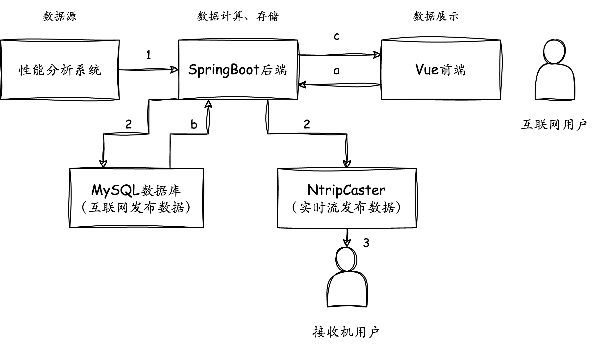

第一类数据流向，数据的前半生，具有实时性，接收机用户可以使用（不考虑上游断开的异常情况）：
1. 系统从上游的性能分析系统获取若干包差分状态与差分改正数，加入部分历史数据，形成整体数据1；
2. 将整体数据1进行两种转化，第一种需要持久化存储到数据库中，需要转化为数据库可存储的形式；第二种需要实时传输到Ntripcaster，需要二进制转化；
3. 接收机用户持续收到数据
   第二类数据流向，数据的后半生，不具有实时性，互联网用户可以使用
   a. 用户在浏览器点击页面，向后端发送请求
   b. 后端根据用户请求，在数据库中查询出结果
   c. 将查询的结果返回到前端展示，呈现给用户

挂载点设计的改变，需要对 SpringBoot 后端做很大的改动，因此不如直接进行重构，将最核心最复杂的数据计算、存储功能从后端中解耦出来


## 未来的软件架构

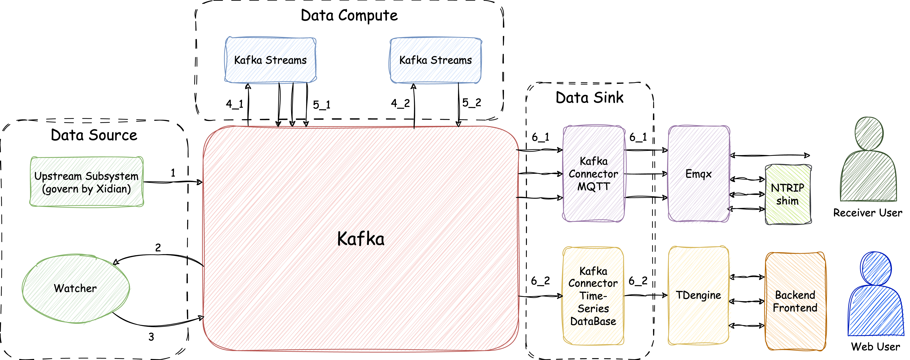

以Kafka为中心的IoT流计算存储发布平台

除了NTRIP shim和前端部署在公网用户可以访问，Emqx可以选择放在内网或者在公网，剩下的都在内网工作，
用户不可见。Kafka、Emqx、TDengine开源版本可以满足要求，不需要购买商业版，有身份验证机制，只有本系统内的授权用户可以访问，防止恶意攻击，
可观测性则通过grafana面板查看运行状态，前端后端可以复用现有成果，NTRIP shim、Watcher、Kafka Streams四处需要新开发，承载的硬件架构为

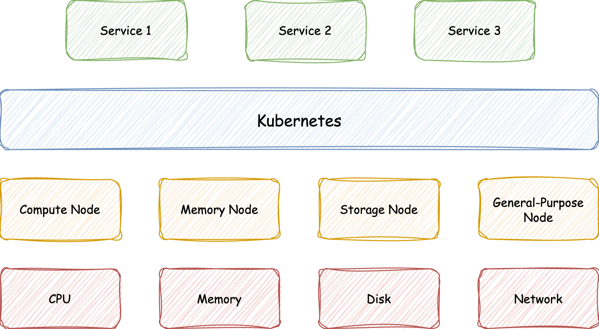

系统的部件都经过了云原生认证，Kubernetes 经过细致的配置管理后，可以实现故障迁移、服务的扩容缩容，保证系统的硬件软件高可用性，实现无人值守
   
案例参考：https://www.taosdata.com/tdengine-user-cases/5007.html
   

按照数据从产生到最终使用的全生命周期，介绍一下相关的端到端过程


### 针对1:
过程1为上游系统向本系统发送差分站状态与差分改正数
之前的做法，上有性能分析系统向系统推差分状态与差分改正数，采用的是最原始的TCP方式，受限于单个包能传输数据大小，一次的数据需要分成10多个包传输，
导致异常情况难以处理。为了解决上述痛点，系统将采用比TCP更高级的消息队列Kafka，单条消息最大1MB相当于4万行json大小，可以一次性将数据传输完毕，
解决了分包问题，也将消息的发送接受过程解耦。

这部分涉及到两个系统之间数据交换，因此，需要双方对数据格式有一个契约共识，之前的做法是在ICD文档规定了消息的格式例如字段名称、字段长度等，
属于是软约束，无法在代码开发层面保证，此前发生过上游数据传输格式异常的问题。为了解决上述痛点，系统将采用AVRO序列化反序列化系统，
通过定义Schema模板（作用相当于表格，限制了能填写的内容），通过模版生成类，上游下游都是Java开发比较好迁移，只有这个类符合数据定义才能被发送和接收，也更加方便系统后续更新维护。

目前的格式限制是字符串形式，相当于是双方的口头承诺，无法强制执行，而使用AVRO之后，相当于落到实处，强制双方按规则执行

接上一点，因为已经采用了硬约束，因此有必要对数据格式进行更新，在格式中保留更多数据语义即数据表达的意思（整数1表达的意思比字符串“1”要丰富，
字符串对人类友好，具体类型对计算机友好，因为避免了二义性意义明确，更具描述性），毕竟这还是系统内部的接口，应该考虑的是可读性调试性，
之前都是固定长度的字符串传达的信息很少，意见如下

| 序号 | 字段范围 | 字段类型 | 内容（示例） | 数据描述 |
|------|----------|----------|--------------|----------|
| 1    | 1-4      | 帧头     | #DAT         | 正常数据或响应查询的数据 |
| 2    | 6-9      | 数据来源 | SJFX         | 数据来源 |
| 3    | 11-12    | 数据类型 | 01           | 数据类型编号 |
| 4    | 14-15    | 数据包数目 | 12         | 差分数据包的数目，共两位 |
| 5    | 17-18    | 本包数据序号 | 01       | 本包数据的序号，共两位，序号最小值为1，最大值等于数据包数目 |
| 6    | 20-31    | 数据包产生时间 | 230303153820 | 本包数据的产生时间，UTC时间，YYMMDDHHMMSS |
| 7    | 33-35    | 数据长度 | 857         | 本包数据长度，不超过999 |
| 8    | 37-40    | 差分站编号 | 0000       | 共4位，范围：0-1023 |
| 9    | 42-53    | 差分站状态产生时间 | 230303153820 | 共12位，差分站状态产生时间，UTC时间，YYMMDDHHMMSS |
| 10   | 55       | 差分站状态 | 1         | 共1位，差分站状态：正常、故障 、检修 |
| 11   | 57-58    | 发播台编号 | 01        | 共2位，范围：0-16 |
| 12   | 60-71    | 差分模型起点时刻 | 230303153820 | 共12位，差分站状态产生时间，UTC时间，YYMMDDHHMMSS |
| 13   | 76-79    | 差分改正参数a0 | -2048.0 | 7位，正数时加+，负数时加-，单位ns |
| 14   | 81-87    | 差分改正参数a1 | -1.2345 | 7位，包括符号位，正数时加+，负数时加-，单位ns/s，范围：-2~2ns/s |
| 15   | 89-90    | 模型参数数据龄期 | 2      | 2位，“00”—3min，“01”—5min，“10”—10min |
| 16   | 92-93    | 发播台编号 | 01        | 共2位，范围：0-16 |
| 17   | 95-106   | 差分模型起点时刻 | 230303153820 | 共12位，差分站状态产生时间，UTC时间，YYMMDDHHMMSS |
| 18   | 108-114  | 差分改正参数a0 | -2048.0 | 7位，正数时加+，负数时加-，单位ns |
| 19   | 116-122  | 差分改正参数a1 | -1.2345 | 7位，包括符号位，正数时加+，负数时加-，单位ns/s，范围：-2~2ns/s |
| 20   | 124-125  | 模型参数数据龄期 | 2      | 2位，“00”—3min，“01”—5min，“10”—10min |
| 21   | 127-128  | 发播台编号 | 01        | 共2位，范围：0-16 |
| 22   | 130-141  | 差分模型起点时刻 | 230303153820 | 共12位，差分站状态产生时间，UTC时间，YYMMDDHHMMSS |
| 23   | 143-149  | 差分改正参数a0 | -2048.0 | 7位，正数时加+，负数时加-，单位ns |
| 24   | 151-157  | 差分改正参数a1 | -1.2345 | 7位，包括符号位，正数时加+，负数时加-，单位ns/s，范围：-2~2ns/s |
| 25   | 159-160  | 模型参数数据龄期 | 2      | 2位，“00”—3min，“01”—5min，“10”—10min |
| 26   | 162-165  | 差分站编号 | 0000       | 共4位，范围：0-1023 |
| ...  | ...      | ...      | ...          | ... |
|      | 结束符   | `<回车><换行>` | 共2位 |


AVRO支持的数据类型如下

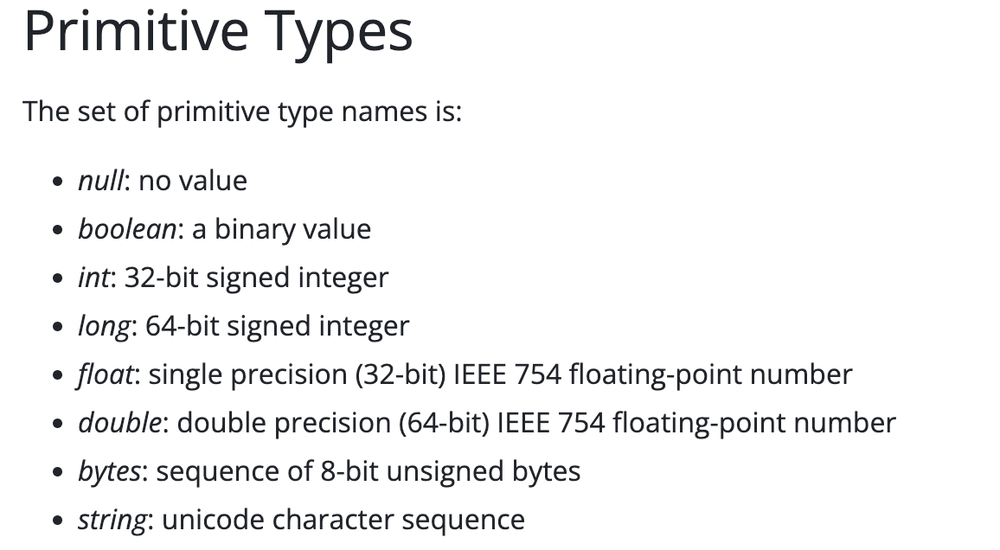

帧头、数据来源、数据来源、数据包数目、本包序列号这些，无意义，全都删除  
数据包产生时间，有意义，需要保留，但是需要提升为更高级的日期形式，选择逻辑类型Timestamp(millisecond precision)  
数据长度，无意义，删除  
差分站编号，有意义，需要保留，但是需要提升为更高级的整数形式，选择基础类型int  
差分站状态产生时间，同数据包产生时间  
差分站状态，取值只有三种情况正常、故障 、检修，提升为更高级别枚举形式，选择复杂类型Enums  
发播台编号，同差分站编号  
差分模型起点时刻，同数据包产生时间  
差分改正参数a0，有意义，需要保留，提升为更高级别的任意精度模式，选择逻辑类型Decimal  
差分改正参数a1，同差分改正参数a0  
模型参数数据龄期，同差分站状态

这些字段名称的中文名字，取的太随意了，需要提供标准的英文名

如下的例子，给出了上面 Timestamp、int、Enums、Decimal 的应用  

```avroschema
{
  "namespace": "ntsc.cas.cn",
  "type": "record",
  "name": "Demo",
  "fields": [
    {
      "name": "key",
      "type": "int",
      "doc": "可以用来表示差分站编号、发播台编号"
    },
    {
      "name": "value",
      "type": {
        "type": "bytes",
        "logicalType": "decimal",
        "precision": 5,
        "scale": 2,
        "doc": "可以用来表示差分改正参数A0、A1"
      }
    },
    {
      "name": "gender",
      "type": {
        "type": "enum",
        "name": "GENDER",
        "symbols": [
          "male",
          "female"
        ],
        "doc": "可以用来表示差分站状态、模型参数数据龄期"
      }
    },
    {
      "name": "timestamp",
      "type": {
        "type": "long",
        "logicalType": "timestamp-millis",
        "doc": "可以用来表示数据包产生时间、差分模型起点时刻"
      }
    }
  ]
}
```

### 针对2:
过程2为监视模块，将从上游系统获取的数据，完成数据校验（过程1主要限制了格式，但是具体的范围限制，需要通过Java注解进一步补齐加强）剥除异常数据，
与历史数据整合之后，主要是解决上游异常断开和稳定发布的要求，继续通过过程3传递

注解举例，@Past可以自动检查时间是否来自过去，对付Timestamp类型；@Range可以自动检查取值是够在合理区间，对付int类型；Enums类型AVRO原本的限制
已经足够了；Decimal类型，可以确保scale，但是AVRO无法保证precision，需要做额外检查（上游必须做，本系统推荐做，贯彻防御性原则），示例代码中已给出。
这一部分专注于数据校验工作。

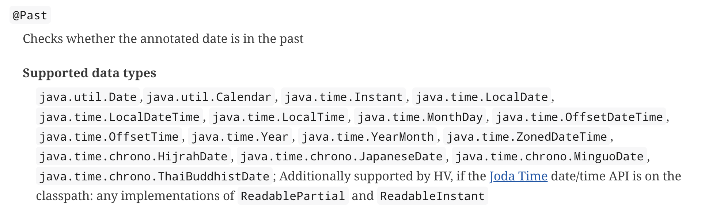

```java
int id = 1;

LogicalType type = Demo.getClassSchema().getField("value").schema().getLogicalType();
int scale = ((LogicalTypes.Decimal) type).getScale();
BigDecimal bigDecimal = new BigDecimal("-999.99").setScale(scale, RoundingMode.HALF_UP);
int precision = ((LogicalTypes.Decimal) type).getPrecision();
// Additional Precision Check!
// Additional Precision Check!
// Additional Precision Check!
if (bigDecimal.precision() > precision) {
    System.out.println("Precision Error");
}
BigInteger bigInteger = bigDecimal.unscaledValue();
ByteBuffer buffer = ByteBuffer.wrap(bigInteger.toByteArray());

ZonedDateTime utcDateTime = ZonedDateTime.of(2024, 10, 25, 14, 30, 45, 0, ZoneId.of("UTC"));

Demo demo = Demo.newBuilder()
        .setKey(id)
        .setValue(buffer)
        .setGender(GENDER.male)
        .setTimestamp(utcDateTime.toInstant())
        .build();

System.out.println(demo);
```

目前的实现中，考虑到了超时、空帧、正常的情况，空帧只在测试阶段有意义，实际运行时，差分站数据绝大部分情况都是有效的，不可能发生175个差分站中1个有效的都不存在的情况。
因此，三种状态修正为


流程图中的过程，可以通过Kafka消费者设置poll超时时间为62秒，如果收到记录，根据收到的内容更新map数据结构的数据、状态；如果超时未收到记录，
更新map数据结构中的状态。然后，两种分支情况统一将map数据结构转化为消息，继续向下游传递，输出到一个新的topic，这个topic是两个Kafka Streams
的数据来源。这一部分专注于历史数据整合工作。

~~上段论述的功能，只是确保数据稳定发布的最终兜底。最好是在数据源端完成，数据源能持续产生数据，下游系统只负责收到数据后做处理，不需要考虑发播周期时序问题。
目前的设计，如果发布周期改变比如说技术突破30秒发布一次，则本系统也需要做相应的配置更改并重启。~~ 还是有必要实现，因为考虑到上游系统宕机的情况，
本系统需要按发布周期传递历史数据，发布周期正常情况下无作用，异常情况下必要，需要按照上面的逻辑实现。但是可以进一步，做到发布周期可以在系统运行过程中动态调整，
不必重启，实现思路为，上游将新的发布周期写入Kafka的cycle topic由上游告知，本系统一直轮询cycle topic，获取到新的发布周期后更新按照新的周期工作。

```java
kafkaConsumer.poll(Duration.ofSeconds(62));
```

举例说明：

假设共有3个差分站，初始化后

```txt
差分站1: 全零初始数据，初始状态
差分站2: 全零初始数据，初始状态
差分站3: 全零初始数据，初始状态
```

上游传来新的差分站数据，但是只包含差分站1

```txt
差分站1: 差分站1数据，正常状态
差分站2: 全零初始数据，初始状态
差分站3: 全零初始数据，初始状态
```

上游异常，62秒内未传来新数据

```txt
差分站1: 差分站1数据，超时状态
差分站2: 全零初始数据，初始状态
差分站3: 全零初始数据，初始状态
```

最终期望达到的效果是，系统启动后，每个差分站60秒内至少有一条数据，数据有三种状态初始、正常、超时（或者叫历史）

为什么说60秒内至少有一条数据？

上游的职责就是正常情况下间隔60秒发一次数据  
首先，本系统不能固定60秒发一次，比如第1分钟发了，过了1秒，上游传递过来新的数据，却滞留到第2分钟才发，导致数据有59秒的延迟，不可以接受，这种机制否定  
其次，能采取的方案是，上游每次来新数据，都启动一个62秒的倒计时闹钟，如果期限内有新数据到来，则重置闹钟；如果期限内无新数据到来（这种情况极少见，属于异常范畴），
则触发超时操作，如此循环往复。因此，就会导致一种情况，上游工作一段时间宕机，本系统期间发布历史数据，刚发完一次历史数据，上游就恢复发来了新数据，
新数据也会立即发布，导致短时间内发布两次的情况，不过这种情况机少见，两个系统衔接时重新同步时序会出现一次，可以容忍。

为什么需要初始状态？

如果本系统启动后，上游性能分析系统迟迟不发送数据的话，如果不采取措施，本系统也无法产生数据，无法维持对外稳定发布的要求，因此在系统启动初期发送
初始的全零数据，直到上游系统传递过来有效数据

为什么需要超时状态？

比如说，1号差分站之前一直正常，突然数据异常无法通过，这时候就需要转化为超时状态，发送上一次的有效数据


### 针对3:
经过过程2的处理，能确保每个差分站都有数据和状态，确保系统稳定对外发布，传递到下一个流程继续处理


### 针对4:
两个流计算任务，主要是将过程3产生的一条大消息，处理成每个差分站对应的消息，消息格式有两种，第一种用于对接收机的实时发布、第二种用于互联网用户的数据库访问。
举例说明，过程3产生的一个大JSON包含3个差分站信息

```json
{
  "data": [
    {
      "diff_id": 1,
      "diff_data": "data1"
    },
    {
      "diff_id": 2,
      "diff_data": "data2"
    },
    {
      "diff_id": 3,
      "diff_data": "data3"
    }
  ]
}
```

对接收机，利用flatMap算子，将大JSON中的每个差分站信息提取出来，完成二进制，每个差分站转化的结果输出到单独对应的 topic 中
（每个topic理解为一条数据通路），实现数据一到多的转换，用于后续发送到Emqx

```txt
主题，数据
差分站1，差分站1二进制数据
差分站2，差分站2二进制数据
差分站3，差分站3二进制数据
```

为什么选择Emqx？

MQTT本来就是物联网领域很常用的一个数据发布协议，适用于低功耗、网络波动的场景，能提共三种QoS最多一次、最少一次、精确一次，但是需要明确指出订阅主题，
无法实现NTRIP中根据地理位置自动确定挂载点，因此，额外需要一个NTRIP shim部件来弥补这部分不足，接收机用户也可以选择使用MQTT协议来获取，多一种选择  
Emqx为中国软件，在信创、去IOE的背景下，能规避掉一些风险

对互联网，利用flatMap算子，将大JSON中每个差分站信息提取出来，转化为 InfluxDB Line 协议格式，结果输出到一个相同的topic即可，
用于后续以Schemaless的方式存到时序数据库TDengine

```txt
+-----------+--------+-+---------+-+---------+
|measurement|,tag_set| |field_set| |timestamp|
+-----------+--------+-+---------+-+---------+
diff_data,diff_id=1 diff_data=data1 timestamp
diff_data,diff_id=2 diff_data=data2 timestamp
diff_data,diff_id=3 diff_data=data3 timestamp
```

为什么选择TDengine？

差分状态与改正数有一个最大的特点，就是随着时间不断到来的，而且存入数据库后不会做修改，只会做多数统计分析查询和少数删除操作，
这种情况有一种量身定制的OLAP时序数据库，比传统的OLTP关系型数据库MySQL性能更好  
TDengne也是中国软件，在信创、去IOE的背景下，能规避掉一些风险

Kstream flatMap算子例子

```java
KStream<byte[], String> inputStream = builder.stream("topic");
KStream<String, Integer> outputStream = inputStream.flatMap(
new KeyValueMapper<byte[], String, Iterable<KeyValue<String, Integer>>> {
Iterable<KeyValue<String, Integer>> apply(byte[] key, String value) {
String[] tokens = value.split(" ");
List<KeyValue<String, Integer>> result = new ArrayList<>(tokens.length);
       for(String token : tokens) {
           result.add(new KeyValue<>(token, 1));
       }
       return result;
   }
});
```

Kstream to 算子文档，将不同记录动态路由到不同的topic

```java
void to(TopicNameExtractor<K,V> topicExtractor,Produced<K,V> produced)
Dynamically materialize this stream to topics using the provided Produced instance. The topic names for each record to send to is dynamically determined based on the TopicNameExtractor.
Parameters:
topicExtractor - the extractor to determine the name of the Kafka topic to write to for each record
produced - the options to use when producing to the topic
```

### 针对5:
过程4实现一到多的处理后，将处理后的结果写回到Kafka，用于流水线后续处理


### 针对6:
过程6，经过前面的过程数据已经处理完毕，只差最后一步就可以让用户用起来，将Kakfa中的数据最终送到Emqx和TDengine。幸运的是需要使用到的两个Connector都有开源实现，作为Kafka与外部系统的桥梁。
对接收机，将每个差分站二进制数据通过Connector发送到Emqx，Kafka中的topic与Emqx中的topic一对一关系，一个topic对应一个挂载点，接收机用户可以选择NTRIP协议或者MQTT协议获取，解析方式一样

| 序号 | 字段范围 | 字段类型 | 内容（示例） | 数据描述 |
|------|----------|----------|--------------|----------|
| 9    | 42-53    | 差分站状态产生时间 | 230303153820 | 共12位，差分站状态产生时间，UTC时间，YYMMDDHHMMSS |
| 12   | 60-71    | 差分模型起点时刻 | 230303153820 | 共12位，差分站状态产生时间，UTC时间，YYMMDDHHMMSS |
| 17   | 95-106   | 差分模型起点时刻 | 230303153820 | 共12位，差分站状态产生时间，UTC时间，YYMMDDHHMMSS |
| 22   | 130-141  | 差分模型起点时刻 | 230303153820 | 共12位，差分站状态产生时间，UTC时间，YYMMDDHHMMSS |

这里有一点想改进，可以改进。比如说，差分站状态产生时间已知，三个发播台的差分模型起点时刻，举例差分站状态时间不会间隔太久，后面的三个差分模型起点时刻可以不存完整的时间，
存相对于差分站状态产生时间的偏移量。比如说差分站状态产生时间为2303153820，其中一个差分模型起点时刻为2303153823，那存个3就可以，能省一些比特。

对互联网，将行协议通过Connector存储到TDengine中，表现为一张超级表175张子表，超级表相当于类代表的是差分状态与差分改正数，
子表相当于对象代表的是具体差分站的差分状态与差分改正数。网页上如果需要各种统计信息，可以通过查询数据库得到结果，TDengine提供了很多与时间范围相关的特色查询，
比如说查询最近15分钟内某个差分站发播台A0的平均值、最大最小值、方差，数据发播三种状态初始、正常、历史的条数统计等通过一条SQL语句就可以实现，使用起来非常方便。

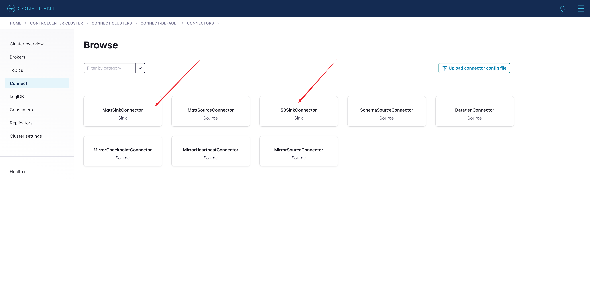


## 现存问题
主要是关于差分状态与差分改正数的一些性质
1. 文档中差分状态与差分改正数60秒来一次，是严格60秒？还是不一定60秒？是否有波动？
2. A0、A1的取值范围，我理解A0就类似“-2048.0”这样最多5位有效数字（0.1只有1位）1位用于小数，范围-9999.9到+9999.9（理解成-99999到+99999，乘0.1），
3. A1类似“-1.2345”这样最多5位有效数字4位用于小数，范围-9.9999到+9.9999（理解成-99999到+99999，乘0.0001），对应到Decimal中precison最多为5，scale分别为1和4？
   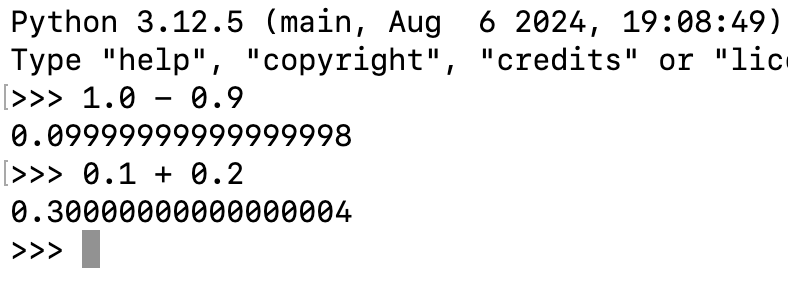
   浮点数会导致数据不精确，例子如上图
3. 发播台和差分站究竟是什么关系？差分站有175个，发播台只有16个。正常情况下，一个差分站下三个发播台，为什么会出现一个差分站下两个发播台甚至一个发播台的情况？缺失发播台数据如何补全之前是填零？
4. 既然上游不一定发175个差分站的数据，一般情况下有多少个，希望能有个大致范围？
5. 如果上游不发新数据，发历史数据是否可以接受（武总之前对电文软件提出过异议）？
6. 最开始软件启动的时候，为了确保稳定发布，差分站没有有效数据，填全0是否合适？
7. 接受机如何使用数据已经很清晰了，为了支持互联网发布，进行数据存储时做哪些支撑来满足用户使用要求，涉及到数据库的字段设计，也就是说需要明确互联网发布的所有功能？
8. ......


## 前端建议
数据以现有模式呈现，为了防止数据库压力过大崩溃，需要在前端限制用户检索下载频率

检索时，通过CAPTCHA强制进行人机验证，避免接口被机器滥用


下载时，需要查询数据库生成文件，查询范围需要限制比如说一周，强制等待120秒才能下载

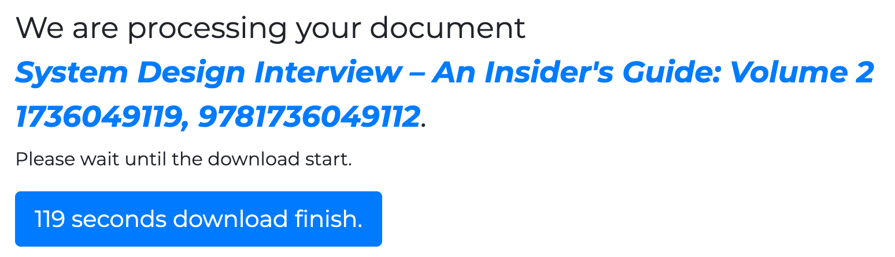


## 实际运行
Confluent 平台

topics，主题已经成功创建

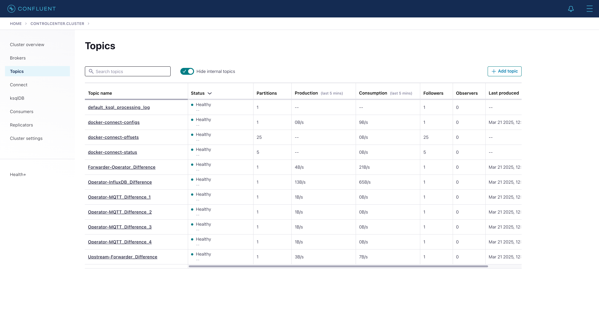

connectors，两个都在正常工作
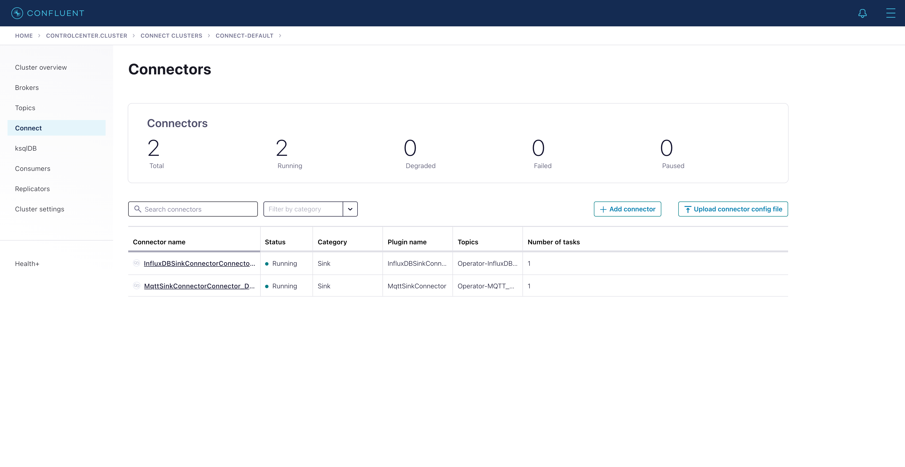

consumer groups
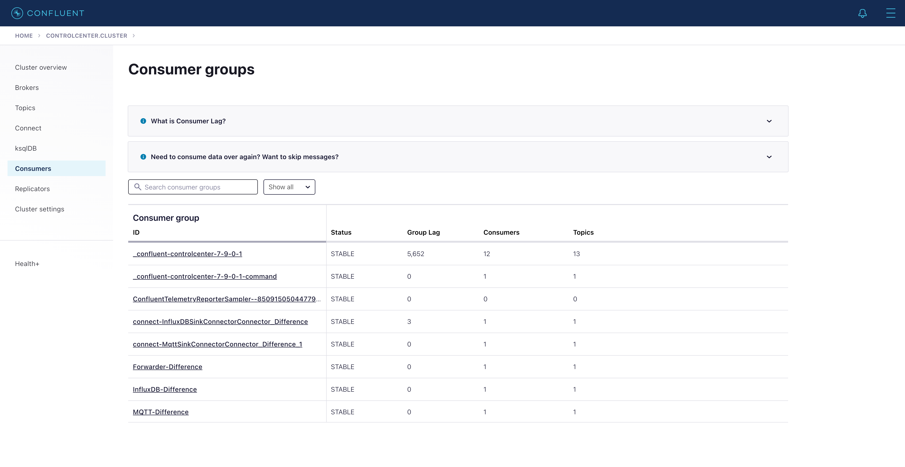

overview
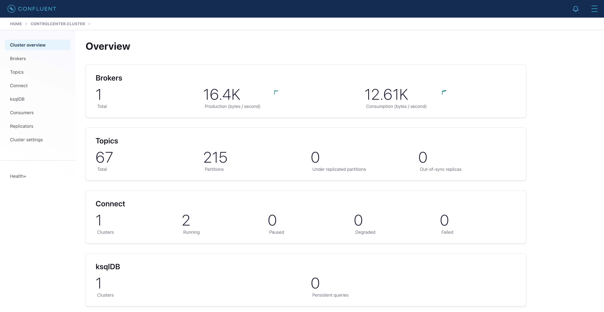

MQTT 平台 mosquitto 
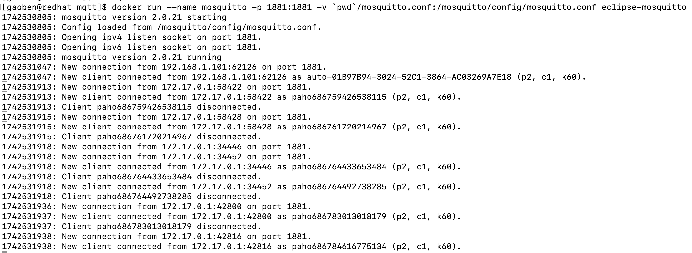

InfluxDB 数据库，数据正确存入
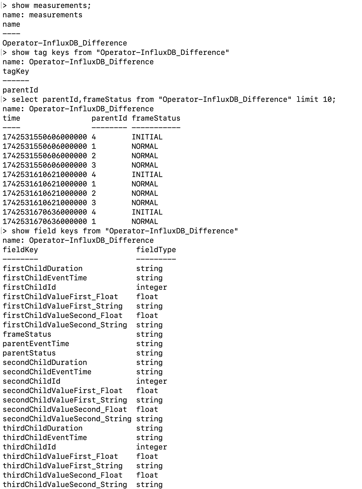

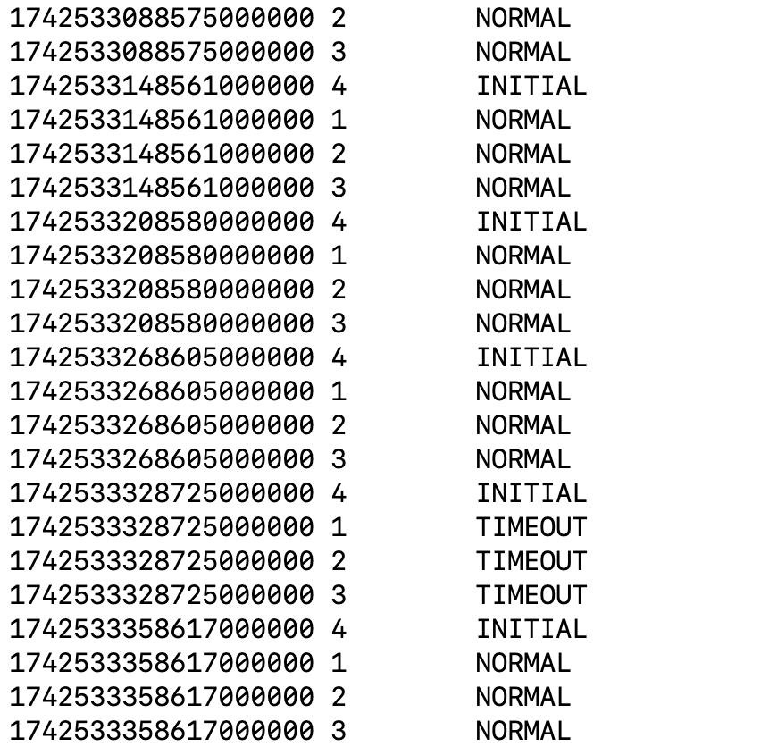

MQTT 用户，用户可以消费到正确的二进制数据
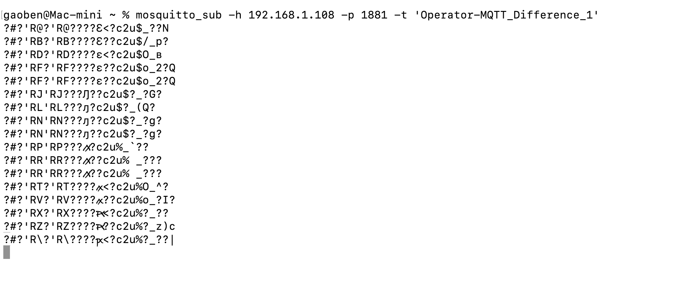